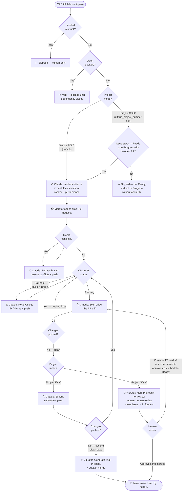

[](https://github.com/outrightmental/vibrator/actions/workflows/test.yml)

# Vibrator

**Turn a GitHub issue queue into a self-driving Claude vibe-coding factory.**

`vibrator` is a TypeScript orchestrator that closes the loop on agentic software development. Write issues. Vibrator handles the rest: it picks up each issue, asks Claude to implement it in a local checkout, opens a draft pull request, self-reviews the diff, fixes anything that needs fixing — review comments, merge conflicts, failing CI — writes a polished final description, and squash-merges. Then it moves on to the next issue.

It is for developers who want the creative part of software development — expressing intent and reviewing outcomes — without babysitting every agent handoff.


## Why this exists

Modern coding agents are powerful, but they still need a conductor — someone to decide what starts next, avoid overloading the repo, notice blocked tasks, run a review pass, route fixes back for another round, preserve closing references, and merge the finished work.

`vibrator` makes that conductor programmable and autonomous, with Claude as the worker behind every step.

Give your repository a prioritized issue backlog and run the loop. The project becomes a living assembly line:

```text
issues → Claude implementation → PR → self-review → fixes → squash merge
```

## For the solo developer

Vibrator is a force multiplier for a solo developer who wants to stay in the creative and strategic flow. You decide what matters — write the issues, set the acceptance criteria, shape the architecture. Vibrator handles the mechanical work:

- **Picks up the next unblocked issue automatically**, so you never lose momentum between tasks.
- **Implements, reviews, and merges in the background** while you focus on design, testing, and product direction.
- **Resolves merge conflicts quietly** — when branches diverge, Vibrator asks Claude to rebase and fix the conflicts before continuing the review cycle, without you ever touching a rebase command.
- **Fixes failing CI without being asked** — it reads the check logs and pushes a fix.
- **Keeps the PR queue clean** — only finished, merged work accumulates; no half-baked draft PRs or stale branches.
- **Respects your control** via the `manual` label — apply it to any issue or PR you want to keep under your direct hand.

The result: you stay in your highest-value role while Vibrator pulls weight in the background to maintain the project's forward momentum.

## SDLC decision tree

The diagram below shows the full lifecycle of an issue through Vibrator, covering both **Simple SDLC** (fully automated, the default) and **Project SDLC** (human-in-the-loop via a GitHub Projects board).



## Simple SDLC

In Simple SDLC mode — the default for any project whose `env.yaml` entry has no `github_project_number` — Vibrator runs fully autonomously from issue to merged PR:

1. Any open, unblocked, non-`manual` issue is eligible to start.
2. Issues are prioritized bugs-first, then by milestone, then by creation time.
3. Claude implements, the PR opens as a draft, Claude self-reviews twice (CI gates apply after any code-changing pass; two consecutive clean passes trigger the merge), and Vibrator squash-merges — no human action required.
4. Merge conflicts and CI failures are handled quietly in the background.

This mode is ideal for personal projects, greenfield work, and any context where CI and branch protections serve as the safety net.

## Project SDLC (Human-in-the-Loop)

Enable Project SDLC per project by setting `github_project_number` in `env.yaml` to a GitHub Projects v2 board number. This mode adds a human review gate before any merge:

1. Issues in **Ready** status are picked up, and issues already in **In Progress** are also picked up if they have no open PR linked and no active agent session already running.
2. When work starts on a Ready issue, it moves to **In Progress**.
3. After one clean self-review, Vibrator marks the PR ready-for-review, requests human review, and moves the issue to **In Review** — it never auto-merges.
4. Vibrator resumes work automatically if:
   - A human converts the PR back to a draft (wants more changes).
   - A new review comment arrives on the PR.
   - The issue is moved back to **Ready** on the project board.

List the GitHub logins to notify when a PR is ready under the project's `reviewers` key in `env.yaml`.

This mode suits teams where a human QA or architect approves each merge, while Vibrator handles the full implementation-review-fix loop.

## What it does

On every iteration, `vibrator`:

1. Loads open GitHub issues, open pull requests, pending workflow approvals, and local agent-session state.
2. Builds a dependency-aware work plan from issue age plus relationships like `blocked by #123`, `depends on #123`, and `blocks #123`.
3. Enforces a configurable concurrency limit so the repo does not get flooded with half-finished work.
4. For each eligible issue, runs Claude locally in a fresh checkout to implement the change and open a draft pull request.
5. Checks CI status on every open PR — waits for passing checks before advancing, fixes failing checks, and escalates checks stuck for more than 10 minutes.
6. Detects merge conflicts and asks Claude to resolve them before continuing.
7. Asks Claude to self-review the diff and push fixes if needed. Requires two consecutive clean self-reviews before advancing.
8. Generates a polished final PR description with Claude, updates the PR body, preserves closing references, and squash-merges. Retries with `--admin` if GitHub's branch policy requires it.

## The big idea

`vibrator` treats GitHub as the source of truth and Claude as the worker behind every action:

- **Issues are intent.** Write clear issues and dependencies; the loop decides when they are safe to start.
- **Pull requests are work cells.** Each PR moves through review, fix, re-review, and merge phases automatically.
- **Local session state is memory.** A small persisted session store prevents duplicate work and lets each loop cycle pick up where the last one stopped.
- **Humans stay in control.** You own the backlog, repository settings, branch protections, CI, and review standards.

See the deeper docs:

- [Design overview](design/SPEC.md)
- [Agent loop and PR lifecycle](design/AGENT_LOOP.md)

## Quick start

Install dependencies:

```bash
npm install
```

Log in to Claude Code (once, if not already done):

```bash
claude login
```

Create `env.yaml` from the template, then add a GitHub PAT under `github_tokens` and the repositories to run under `projects`:

```bash
cp env.example.yaml env.yaml
# edit env.yaml: set github_tokens[0].token and projects[].github_repository
```

`env.yaml` is the only place Vibrator reads settings from (it is git-ignored). See [Configuration](#configuration) for every key.

Run a safe one-shot preview:

```bash
npm start -- --dry-run --once
```

Run the real loop:

```bash
npm start
```

Vibrator loads `env.yaml` from the current working directory and works every repository listed under `projects`; there are no positional CLI arguments.

## Dashboard

`vibrator` opens a single real-time **Dashboard** in your browser at `http://localhost:3000` (change the port with `dashboard_port`) when the loop starts. One dashboard covers **all** configured projects: there is a single shared pool of `max_concurrency` engine cylinders, and each project's own `max_concurrency` caps how many of those cylinders may work it at once. When more than one project is configured, every cylinder, lifecycle pill, broadcast-feed card, and event-log line is labelled with the project (`owner/repo`) it belongs to; with a single project the name appears in the header only. The Dashboard shows:

- **Issue → PR Lifecycle panel**: a row of two-halved pills, one per open issue. The left half shows the issue; the right half shows the linked pull request and transitions through states:
  - *(absent)* — no PR yet
  - *dotted outline* — implementation is planned for this iteration
  - *solid outline, draft* — PR is open as a draft
  - *solid outline, ready* — PR is open and ready for review
  - *completed (full fill)* — PR is merged/closed

  Each pill is colour-coded to a stable slot in the six-colour palette, matching the worker thread assigned to that issue+PR pair.

- **Implementation / Review / Broadcast Feed** panels showing live orchestrator logs and GitHub activity.

To prevent the Dashboard from opening automatically, pass `--no-browser`:

```bash
npm start -- --no-browser
```

The Dashboard server still starts; the URL is printed to stdout so you can open it manually.

**Graceful shutdown**: Press **Escape** while the loop is running to let Vibrator finish any in-flight actions before exiting. Press **Ctrl+C** to exit immediately.

## Requirements

- Node.js 18+
- `git` on `PATH`.
- A GitHub PAT, listed under `github_tokens` in `env.yaml`.
- The `claude` CLI (Claude Code) installed locally, on `PATH`, and logged in via `claude login`. Uses your Claude Code subscription — no API key required.

## Configuration

All configuration lives in `env.yaml` in the working directory; copy `env.example.yaml` to create it. No configuration is read from environment variables. Vibrator uses the GitHub PAT from `github_tokens` directly for API calls and Git clone/fetch/push operations. Claude Code authentication is still handled by the `claude` CLI: `ANTHROPIC_API_KEY`, `GITHUB_TOKEN`, `GH_TOKEN`, and `VIBRATOR_GITHUB_TOKEN` are removed from the environment of every Claude subprocess, so the agent authenticates only through your Claude Code login and the configured PAT.

**GitHub token permissions**

Fine-grained PATs need access to the target repository with:

- Metadata: read
- Contents: read/write
- Pull requests: read/write
- Issues: read/write
- Actions: read/write
- Checks: read
- Commit statuses: read
- Projects: read/write, if using project mode
- Workflows: write, if the agent may push workflow file changes

Classic PATs may need `repo`, `project` when using project mode, and `workflow` when the agent may edit or push workflow files.

**Global keys** (top level of `env.yaml`)

| Key | Default | Purpose |
| --- | --- | --- |
| `github_tokens` | — | **Required.** List of named GitHub PATs, each `{ name, token, default? }`. Projects that set no `github_token_name` use the entry marked `default: true`, or the first entry. |
| `projects` | — | **Required.** List of repositories to run; see the per-project keys below. |
| `max_concurrency` | `3` | Total size of the shared engine-cylinder pool across all projects. |
| `cycle_minimum_seconds` | `60` | Minimum seconds between engine cycle starts. |
| `claude_code_initial_model` | `claude-sonnet-4-6` | Claude model used during initial implementation. |
| `claude_code_review_model` | `claude-opus-4-8` | Claude model used during self-review. |
| `claude_code_initial_effort` | `high` | Reasoning effort for initial implementation. |
| `claude_code_review_effort` | `high` | Reasoning effort for self-review. |
| `claude_describe_model` | `claude-haiku-4-5-20251001` | Claude model used to write the final PR description before merge. A faster model is appropriate here. |
| `dashboard_port` | `3000` | HTTP port for the single shared Dashboard server. |
| `dashboard_title` | `Outright Mental` | Title displayed in the Dashboard header. |
| `github_api_base_url` | `https://api.github.com` | GitHub REST API base URL, for GitHub Enterprise. |
| `github_api_version` | `2022-11-28` | Value of the `X-GitHub-Api-Version` request header. |

**Per-project keys** (each entry under `projects`)

Per-project values override the global ones for that project.

| Key | Default | Purpose |
| --- | --- | --- |
| `github_repository` | — | **Required.** Repository slug in `owner/repo` form. |
| `github_token_name` | default token | Name of the `github_tokens` entry to use for this project. |
| `max_concurrency` | global `max_concurrency` | Cap on how many of the shared cylinders may work this project at once. Never exceeds the global pool. |
| `github_project_number` | — | GitHub Projects v2 board number. Enables [Project SDLC](#project-sdlc-human-in-the-loop) for this project. |
| `reviewers` | `[]` | GitHub logins to request review from (Project SDLC only). |
| `focus_mode` | `false` | When `true`, only issues labelled `focus` (and the PRs that advance them) are worked. |
| `claude_code_initial_model` / `claude_code_review_model` | global value | Per-project model overrides. |
| `claude_code_initial_effort` / `claude_code_review_effort` | global value | Per-project effort overrides. |
| `claude_describe_model` | global value | Per-project override for the final-description model. |
| `cycle_minimum_seconds` | global value | Per-project override of the cycle minimum. |
| `session_store_path` | `<cwd>/.vibrator/<owner>-<repo>-sessions.json` | Path for persisted local agent-session state. |

**CLI flags**

These are the only command-line options; there are no positional arguments.

| Flag | Purpose |
| --- | --- |
| `--once` | Run a single iteration, then exit. |
| `--dry-run` | Print the plan without executing any Claude or GitHub actions. |
| `--no-browser` | Start the Dashboard server but do not auto-open a browser window. |

Focus mode is a per-project setting, not a flag: set `focus_mode: true` on a project in `env.yaml` and Vibrator will pick up only issues labelled `focus` in that repository, plus the PRs that advance them.

## Issue language the loop understands

Use normal GitHub issues, plus lightweight relationship phrases in the issue body:

```markdown
blocked by #12
depends on #12
blocks #34
```

`vibrator` will not start an issue while any referenced blocker remains open. Older eligible issues start first (bugs first, then milestone order, then creation time), up to `max_concurrency`.

### The `manual` label

Apply the `manual` label to any issue or PR to remove it from automated work:

- **Issues** labeled `manual` are never picked up by Vibrator.
- **PRs** labeled `manual` receive no automated actions (no self-review, no conflict resolution, no auto-merge) and do not count against `max_concurrency`.

Vibrator creates the `manual` label in the repository on startup if it does not already exist.

### The `review` label

Apply the `review` label to an issue to opt it into the
**implement-then-wait-for-review** workflow
([outrightmental.com#409](https://github.com/outrightmental/outrightmental.com/issues/409)):
Vibrator implements the issue, self-reviews, and fixes failing checks exactly
as usual — but after the clean self-review it marks the PR ready and **stops**.
The final PR is never squash-merged; it waits for a human. This is the flag
that automated intake (e.g. Mailbot's note-to-issue pipeline) applies so a
one-line emailed note becomes a reviewable PR without ever landing on `main`
unattended.

- Works in every mode; in Project SDLC it is redundant (that mode already never auto-merges).
- The label is copied onto the PR when it is opened, so the no-merge gate survives even if the issue is closed or relabelled mid-flight.
- A parked PR does not count against `max_concurrency`.
- Converting the PR back to draft, or commenting on it, re-queues it: Vibrator addresses the feedback, self-reviews, and requests review again.
- Removing the label from both the issue and the PR returns the PR to the normal auto-merge flow.

Vibrator creates the `review` label in the repository on startup if it does not already exist.

### Milestone ordering

Milestones act as a priority queue, not a gate. Issues in earlier milestones are preferred over later-milestone issues, but all eligible unblocked issues can start regardless of milestone. Bug-typed issues (GitHub's native Issue Type = "Bug") always jump ahead of every other type.

Priority order: **Bug** > earlier milestone > later milestone > no milestone, then by creation time within each tier.

### Parent and sub-issues

GitHub sub-issues are understood natively. A parent issue is automatically blocked until all of its open sub-issues are resolved — no explicit dependency phrases needed.

## Development

```bash
npm test
npm run build
```

## Status

This project is intentionally small and sharp: a local orchestrator, a GitHub client, a session store, a Claude agent client, and a planning engine. It is early infrastructure for people who want to run software projects as agentic systems instead of manually copying prompts between tabs.
