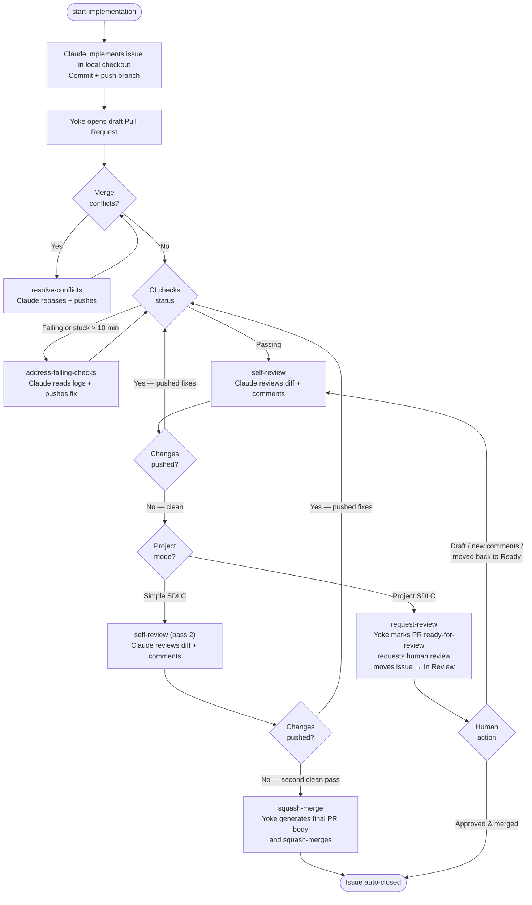

# Agent loop and PR lifecycle

This document describes the end-to-end loop that `yoke` runs against a GitHub repository, with Claude (the `claude` CLI / Claude Code) as the worker for every coding-agent step.

## Mental model

Think of `yoke` as a scheduler plus shepherd:

```text
schedule issue work → run Claude locally → open PR → self-review → fix → re-review → squash merge
```

Every pass through the loop is allowed to make progress. Every step is synchronous — Yoke waits for Claude to finish before moving on. That means sessions only ever sit in `in_progress` state inside a single iteration; on the next iteration they will be either completed (the agent finished and the session was recorded) or failed (the previous process crashed mid-action).

Multiple independent engine loops run concurrently (up to `max_concurrency`). A planning mutex prevents two engines from double-booking the same issue or PR. A shared claim set prevents two engines from executing different actions against the same PR at the same time.

## Loop phases

### 1. Approve pending workflow runs

The loop first checks recent workflow runs for states that indicate maintainer approval is needed. When possible, it approves them through GitHub's workflow approval endpoint; when approval is not applicable, it reports the reason and continues. Only engine 0 runs this step (once per cycle, not once per engine).

### 2. Load repository snapshot

The snapshot includes:

- open issues (with labels, type, milestone, project status, and parent/child relationships),
- open pull requests (draft state, conflict status, CI check status, unresolved review comment count),
- PR-linked issue references from GitHub's closing reference API and PR text,
- PR review state against the current head SHA,
- local agent sessions.

### 3. Reconcile sessions

Every Claude action runs synchronously, so any `in_progress` session observed at the start of an iteration is a leftover from a previous Yoke process that crashed mid-action. The reconciler marks each such session as `failed` so the planner can re-plan its work cleanly. Only engine 0 runs reconciliation.

### 4. Build a plan

The planner prefers shepherding existing PRs before starting more issues — this keeps the repository from accumulating unfinished work.

For PRs, the planner uses the session history for each PR to determine the next action.

For issues, the planner:

- sorts bugs first (GitHub Issue Type = "Bug"), then by milestone number, then by creation time,
- excludes issues already represented by open PRs or active sessions,
- excludes issues blocked by open blockers (via dependency phrases or parent/child),
- excludes issues labeled `manual`,
- in project mode: excludes issues whose project-board status is not "Ready",
- starts only as many as fit inside `max_concurrency`.

### 5. Execute actions

In dry-run mode, execution is skipped after printing the plan. In normal mode, actions call GitHub APIs, authenticated `git`, and the local `claude` CLI as needed. Each action records a completed session at the end.

## Pull-request lifecycle



## Dependency syntax

`yoke` reads dependency hints directly from issue bodies:

- `blocked by #123`
- `depends on #123`
- `blocks #456`

The first two forms mark the current issue as blocked by another issue. The `blocks` form marks the referenced issue as blocked by the current issue.

Only open blockers prevent scheduling. Once a blocker closes, the dependent issue becomes eligible on the next loop.

### Parent and sub-issues

GitHub sub-issues are treated as dependencies automatically. A parent issue is blocked until all of its open sub-issues are resolved — no explicit dependency phrase is needed.

## Issue prioritization

Within eligible unblocked issues, the planner uses this priority order:

1. **Bug** (GitHub Issue Type = "Bug") — always first.
2. **Milestone** — earlier milestone number wins. An issue without a milestone sorts after all milestoned issues.
3. **Creation time** — older issues win within the same priority tier.

Milestones order the queue but never gate it — any eligible issue can start regardless of its milestone.

## The `manual` label

Issues and PRs labeled `manual` are opted out of automated work:

- **Issues** labeled `manual` are never picked up by the planner.
- **PRs** labeled `manual` receive no automated actions and do not count against `max_concurrency`.

Yoke creates the `manual` label in the repository on startup if it does not already exist.

## Closing-reference behavior

The loop collects issue references from:

- GitHub's linked closing issues API,
- PR titles and bodies with phrases such as `fixes #123`, `closes #123`, `resolves #123`, `implements #123`, and `for #123`.

Before merge, missing closing references are appended to the final PR body so GitHub can close the intended issues after the squash merge. If branch protection blocks the GitHub API squash merge, the loop surfaces that error; the API path does not perform the previous CLI administrator-bypass retry.

## Action model

The six orchestrator action types each record a session in the local store. The session phase name matches the action name except for `start-implementation`, which is stored as `implementation`:

| Action | What happens |
| --- | --- |
| `start-implementation` (session: `implementation`) | Claude implements the issue in a fresh checkout and pushes a branch. Yoke opens a draft PR. In project mode, the issue moves to "In Progress". |
| `self-review` | Claude checks out the PR branch, reviews the diff against the base, and either pushes fixes or confirms the code is clean. Human PR comments are included as context. Yoke posts a summary comment on the PR. |
| `address-failing-checks` | Yoke fetches failing CI log excerpts. Claude reads them, pushes a fix, and Yoke posts a comment. Stuck pending checks (> 10 min) are cancelled before Claude reads logs. |
| `resolve-conflicts` | Claude rebases the PR branch on the base branch and resolves conflicts. Yoke posts a comment. |
| `squash-merge` | Claude generates a final PR body from the branch commits and diff. Yoke updates the PR body, promotes the draft to ready-for-review if needed, and squash-merges. |
| `request-review` | (Project SDLC only) Yoke marks the PR ready-for-review, requests human review from configured reviewers, and moves the issue to "In Review". |

Each action is idempotent through session state. A later iteration observes what changed (new head SHA, clean review flag) and moves to the next phase instead of repeating completed work.

## Recommended operating style

- Keep issues crisp, scoped, and independently mergeable.
- Put real acceptance criteria in issue bodies.
- Use dependency phrases instead of relying on issue order alone.
- Start with `--dry-run --once` and a low `max_concurrency`.
- Let branch protection and CI define the normal merge gate; protected-branch merge failures surface directly from GitHub.
- Treat the generated final description as the permanent change record.

## Failure modes to watch

- **`claude` CLI not found / not authenticated**: install Claude Code and run `claude login` to authenticate with your Claude Code subscription.
- **Missing GitHub token / repository access**: add a PAT with access to the repository under `github_tokens` in `env.yaml`, and make sure the project's `github_token_name` (if set) names one of those entries.
- **No PR appears after start-implementation**: check the iteration log — Yoke opens the PR itself via the REST API after Claude pushes, so an error from either step will surface in the action log.
- **Self-review loop repeats**: the planner only advances once two consecutive clean self-reviews are recorded against the current head SHA. If Claude keeps pushing changes, review the PR diff to understand what it is fixing.
- **Final description fails**: confirm `git`, `claude`, and the configured GitHub PAT are available locally.
- **Too much parallel work**: lower `max_concurrency`.
